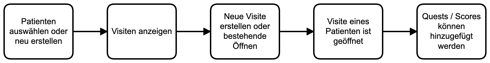

Einleitung
==========

Mit diesem Programm soll eine einfache Eingabe und Verwaltung von klinischen Forschungsdaten im klinischen Kontext ermöglicht werden.
Dafür gibt es einen einfachen CLienten (Electron app), der auf eine SQLITE DB im lokalen Dateisystem zugreifen kann.

Kernidee ist dabei, dass 
   1. ein Patient einer 
   2. Visite zugeordnet wird und dann 
   3. in der Viste verschiedene Items / Fragebögen etc. erhoben werden (hier **Quests** genannt).
Die folgende Abbildung fasst das kurz zusammen.

   Grundprinzip dieser App

Die Daten selber werden in einer SQLITE DB gespeichert. Der Prinzipielle Aufbau der SQL Tables ist in der folgenden Abbildung dargestellt.

.. figure:: _images/abbildung01_bpmn_tables.png
   :height: 400 px
   :align: center

   Übersicht der SQL Tables