Schnellanleitung
================

Mit der Schnellanleitung soll der beabsichtigte Fluss durch die App mit dem Ziel der Dokumentation einer Visite beschrieben werden.

Der Ablauf dabei ist: 
   1. ein Patient einer 
   2. Visite zugeordnet wird und dann 
   3. in der Viste verschiedene Items / Fragebögen etc. erhoben werden (hier **Quests** genannt).

Die folgende Abbildung fasst das kurz zusammen.

.. figure:: _images/abbildung02_bpmn_ablauf_visite.png
   :height: 100 px
   :align: center

   Grundprinzip dieser App

1. Starten der App
------------------
Nach dem Starten der App musst Du beim ersten Start die DB im lokalen Dateisystem verbinden.

Die App erkennt, dass keine DB verbunden ist und startet automatisch die entsprechende Funktion:

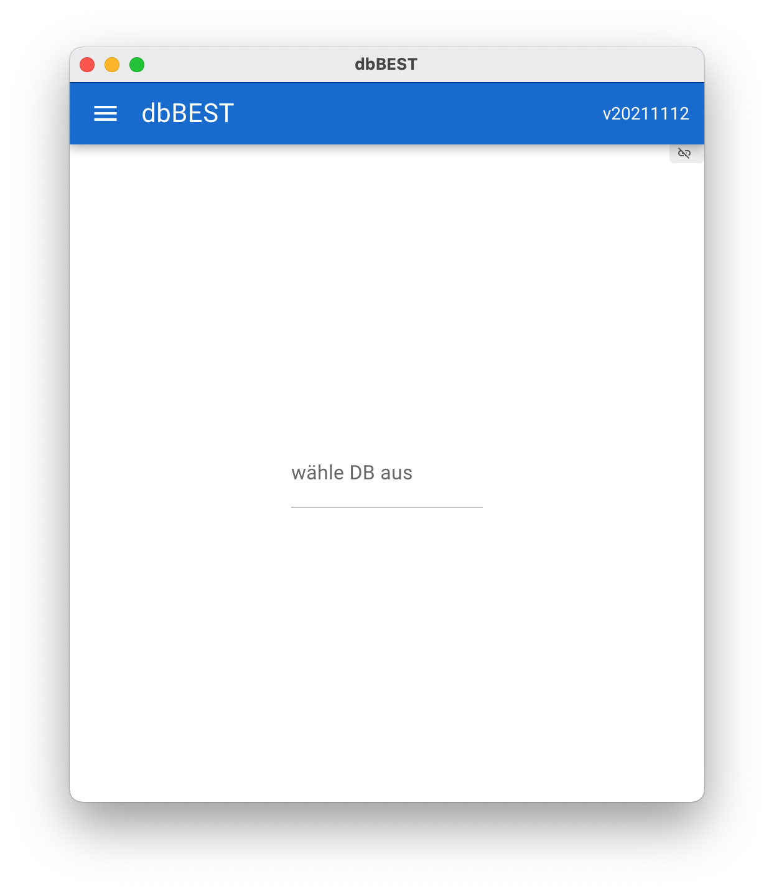

   Auswahl einer DB (1)

Nachdem die DB ausgewählt wurde, einfach auf *Lade DB* clicken. Dann wird man automatisch auf die Startseite weitergeleitet.

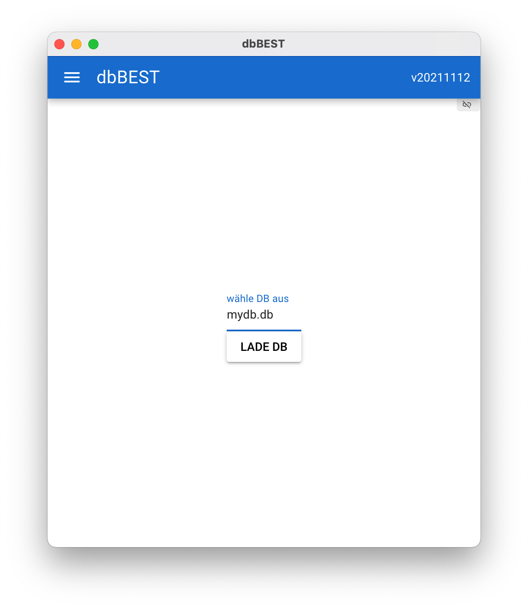

   Auswahl einer DB (2)

2. Patienten suchen und eine Visite planen
------------------------------------------

Auf der Startseite gibt es die Hauptfunktion als direkt-Funktion: **Patienten suchen und eine Visite planen**.

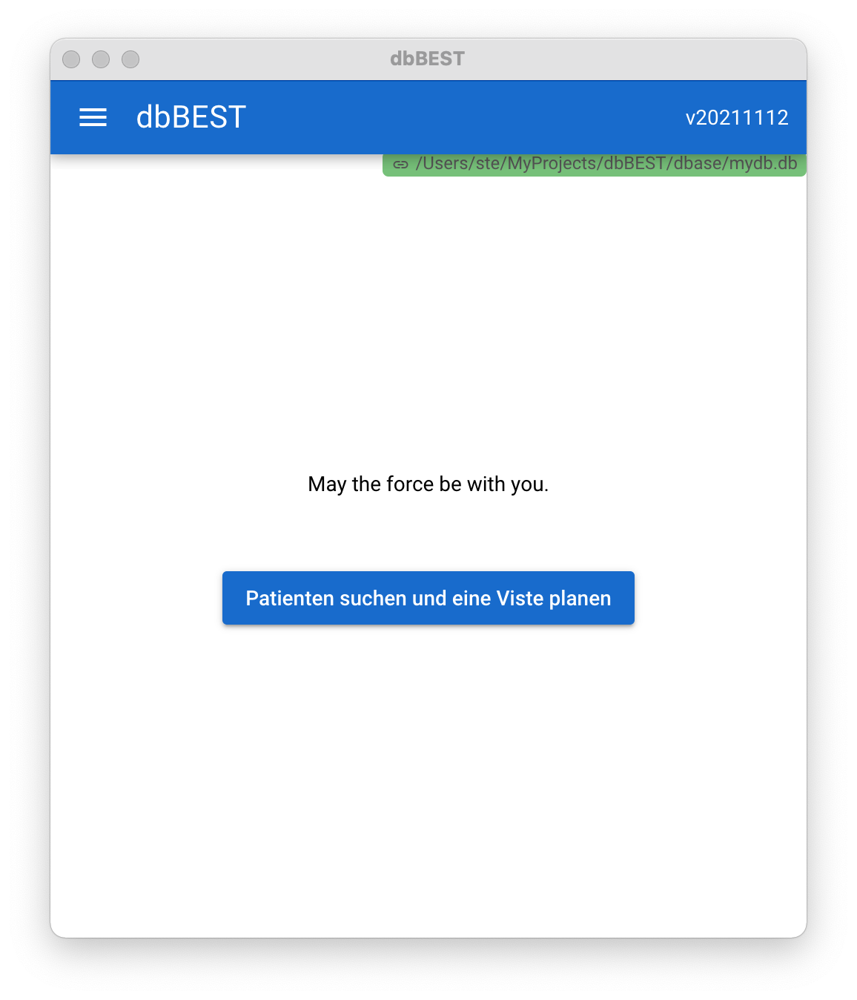

   Startseite (Info: Die Anzeige oben rechts ist grün, wenn die DB korrekt verbunden ist.)

Es öffnet sich anschließend eine Suchmaske, in der ein Patient gesucht oder direkt angelegt werden kann.
Um beispielsweise alle Patienten zu suchen, die mit *S* beginnen kann folgende Eingabe verwendet werden:

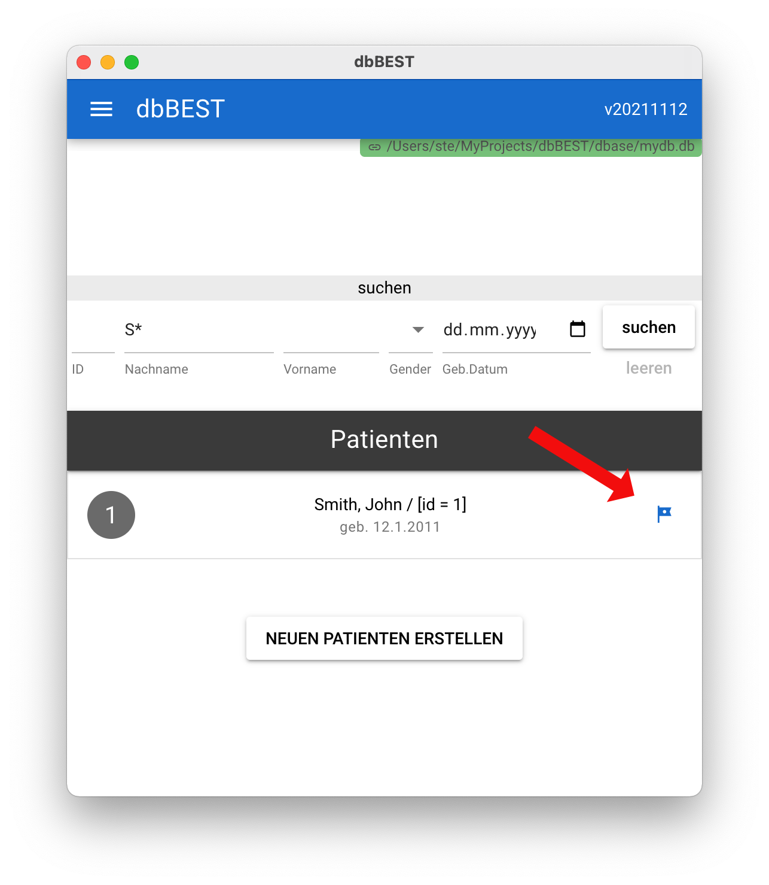

   Suche nach dem Patienten 'S*' gibt hier ein Ergebnis zurück.

Durch Click auf die kleine blaue Fahne, kann dann eine Visite geplant werden.

3. Visiten anzeigen und durchführen
-----------------------------------

Sie werden zum Fenster *Visten anzeigen und durchführen* geleitet.
Hier sind 3 wesentliche Elemente:

   1. Anzeige des aktiven Patienten
   2. Anzeige der exisitierenden Visiten des Patienten
   3. Ein Button zum Anlegen einer neuen Visite

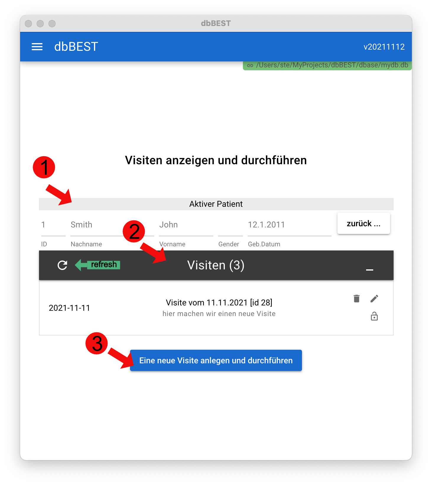

   Anzeige der Visiten eines Patienten

4. Neue Visite anlegen
----------------------
Durch Clicken auf den Button *Eine neue Visite anlegen und durchführen* wird eine neue Visite angelegt und die Visitenseite geöffnet.

Auch hier gibt es wieder 3 Wesentliche Elemente:

   1. Anzeige des aktiven Patienten
   2. Editierbare Visite mit Standardfeldern
   3. Untersuchungen (quests)

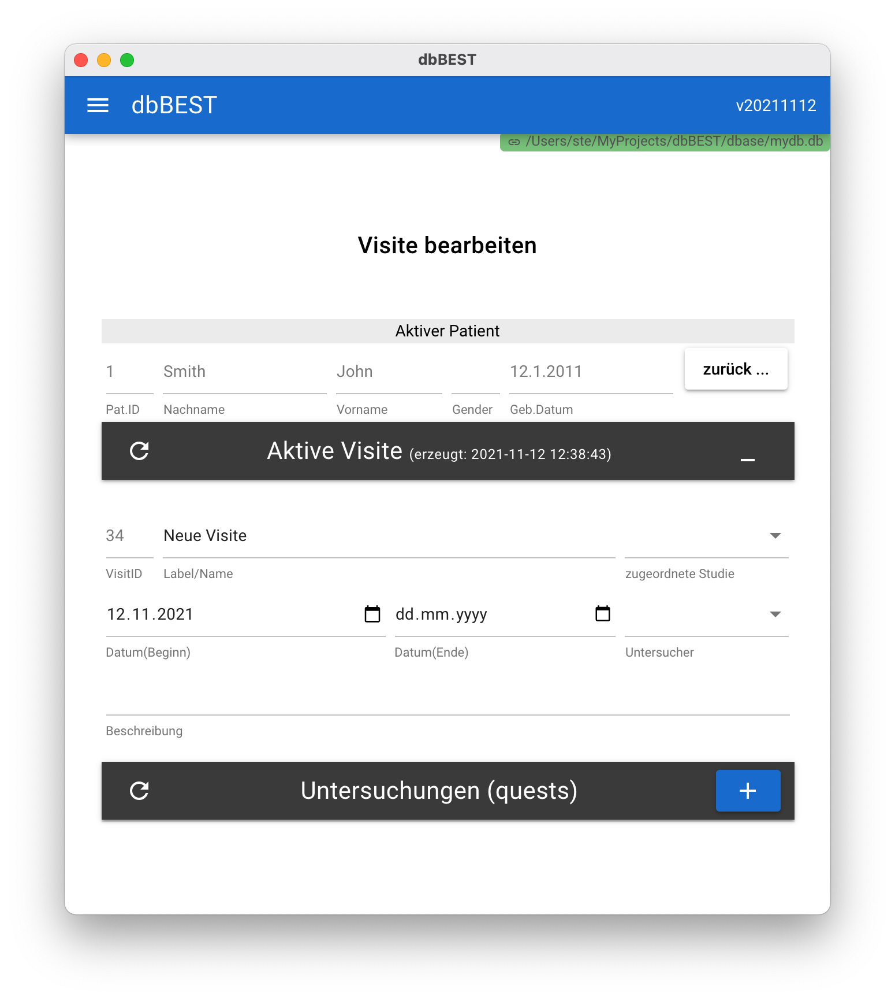

   Neue Visite mit Untersuchungen dokumentieren

Bei Änderungen wird ein *blauer* Speicher-Button angezeigt.

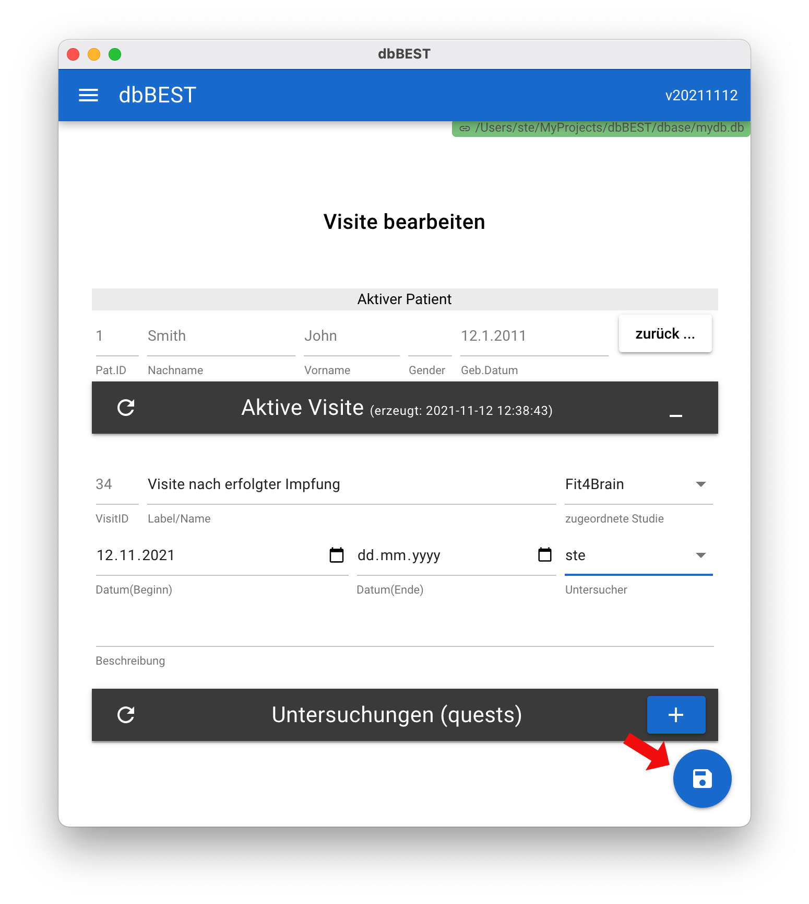

   Neue Visite mit Untersuchungen dokumentieren

5. Untersuchungen (quests) hinzufügen
-------------------------------------

Zu einer Visite können nun verschiedene Untersuchungen / Fragebögen / Quests hinzugefügt werden.
Zudem ist dies kompatible zur Fragebogen-App **surveyBEST**.

Um eine Untersuchung hinzuzufügen, klicke auf den **blaue** Plus-button. Es öffnet sich eine Anzeige der verfügbaren Fragebögen / Vorlagen.

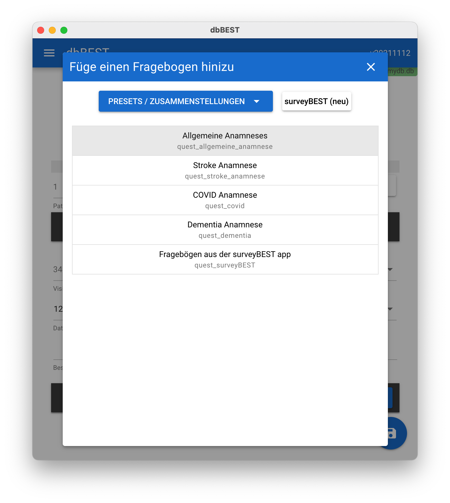

   Anzeige verfügbarer Fragebögen. Oben links gibt es eine Möglichkeit auf *Presets* (Zusammenstellung von verschiedenen Fragebögen) zuzugreifen. Außerdem kann hier direkt eine **surveyBEST** Fragebogen (HTML Format) importiert werden.

Im Beispiel wurden jetzt 2 Fragebögen ausgewählt, mit dem erscheinenden *blauen* hinzufügen-Button können diese der Visite hinzugefügt werden.

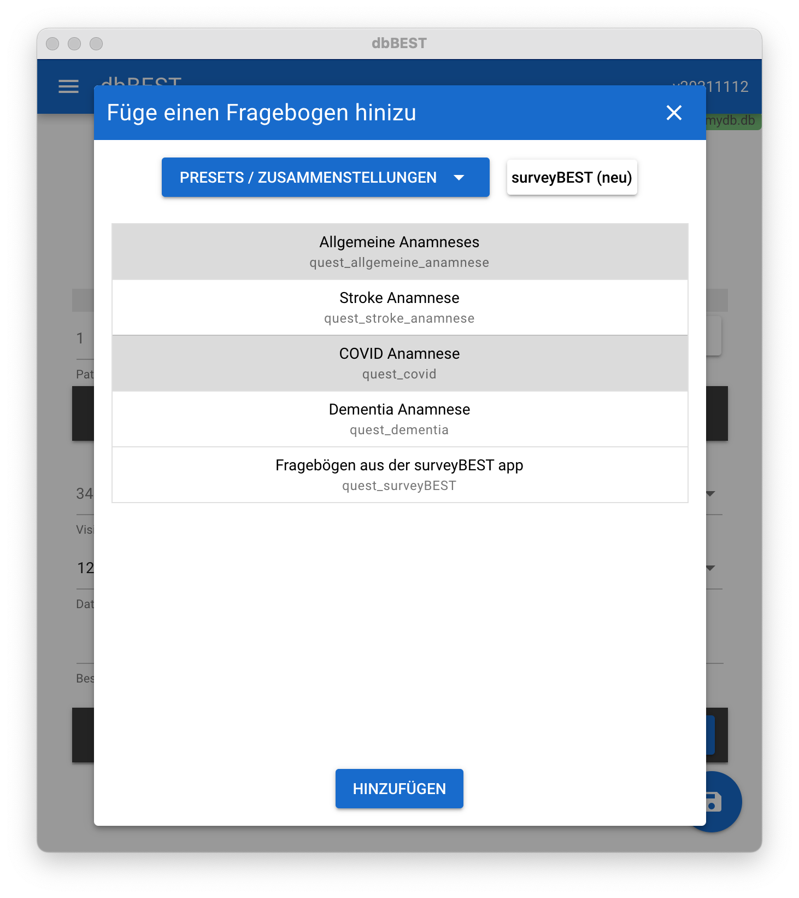

   Ausgewählte Fragebögen hinzufügen 

Nach einem **Klick auf den Refresh-Button** werden die neuen Bögen angezeigt.

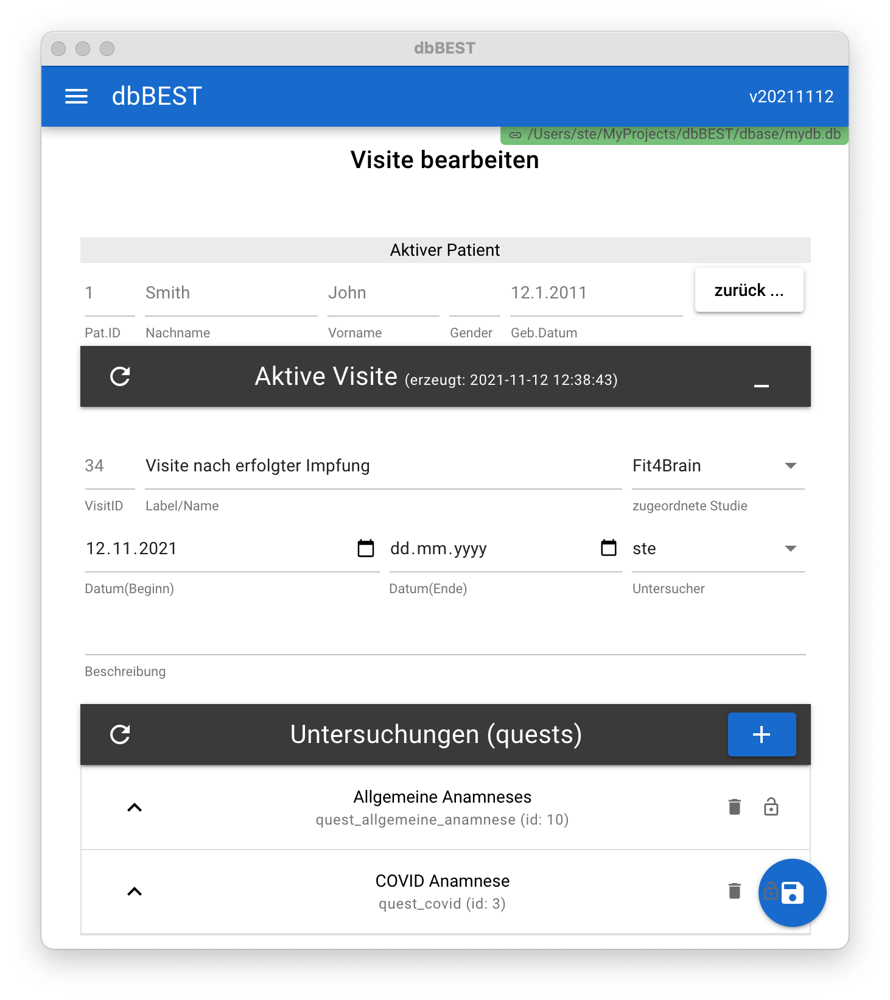

   Ausgewählte Fragebögen sind der Visite hinzugefügt. **Wichtig:** Aktuell muss noch manuell der **Refresh-Button** geklickt werden.

Jetzt können die Fragebögen ausgefühlt und gespeichert werden.

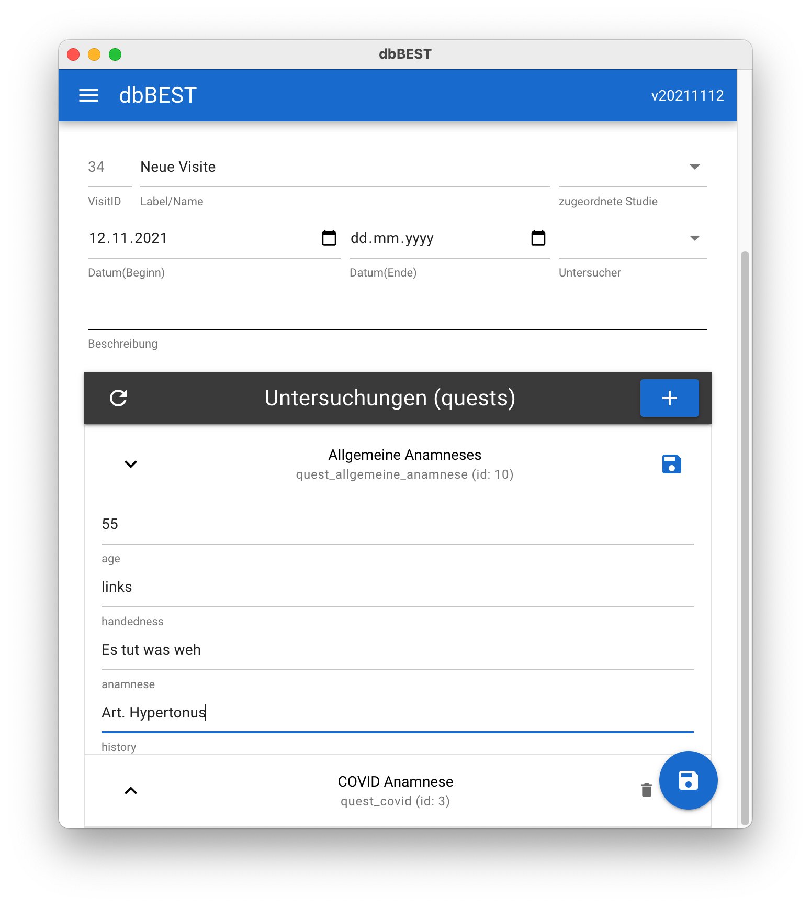

   Speichern