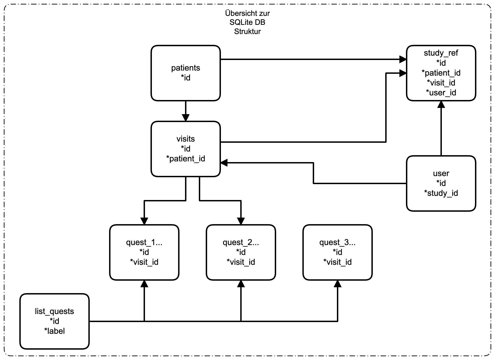
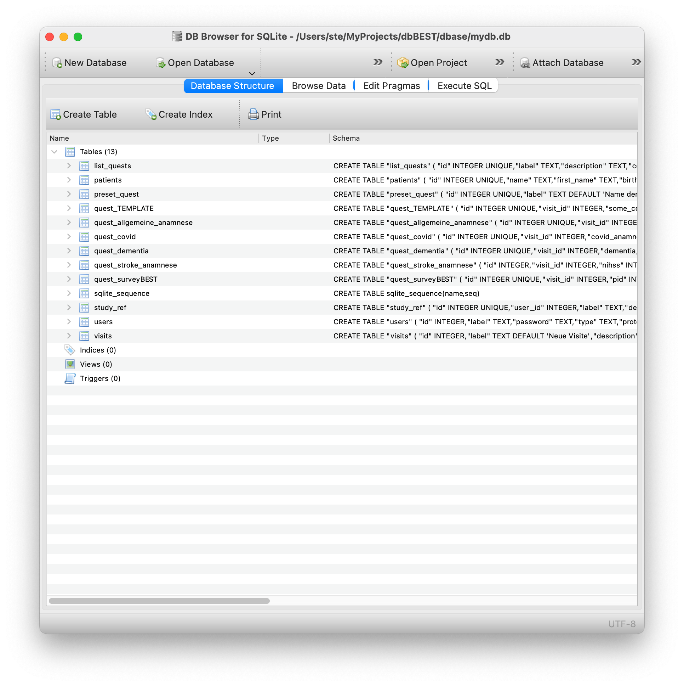
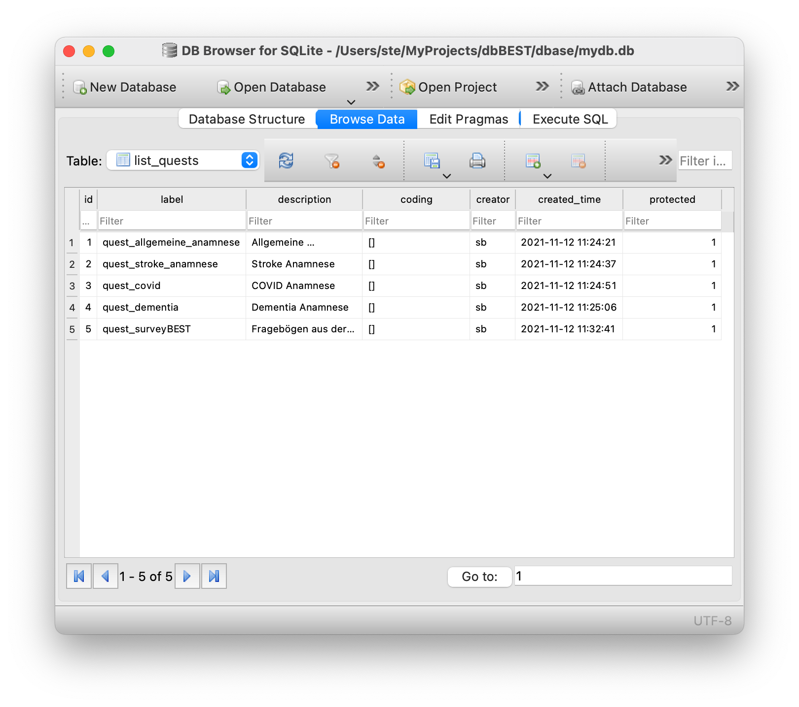
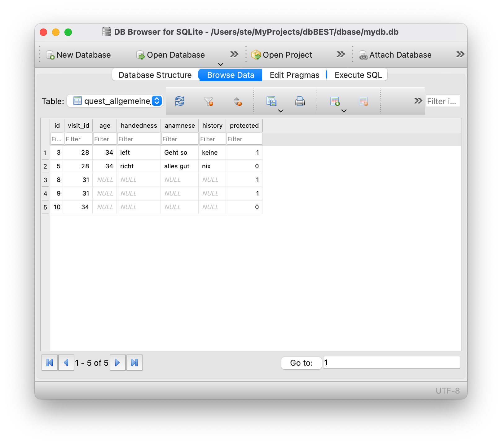
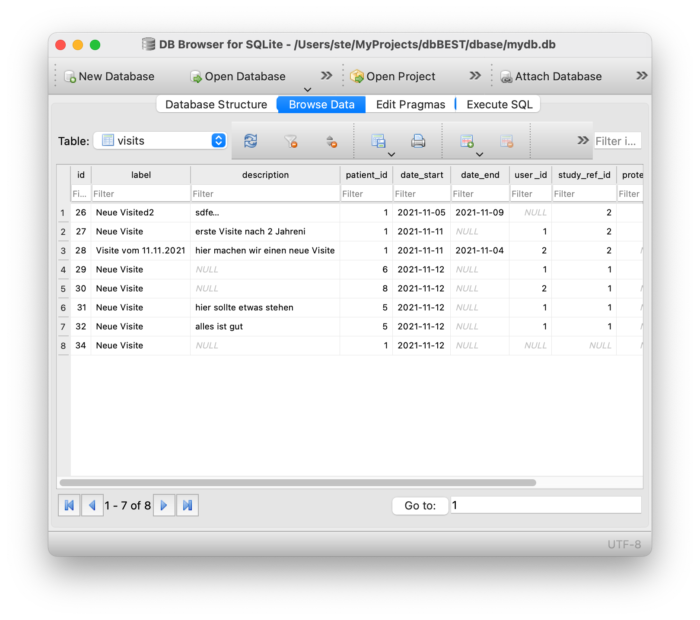
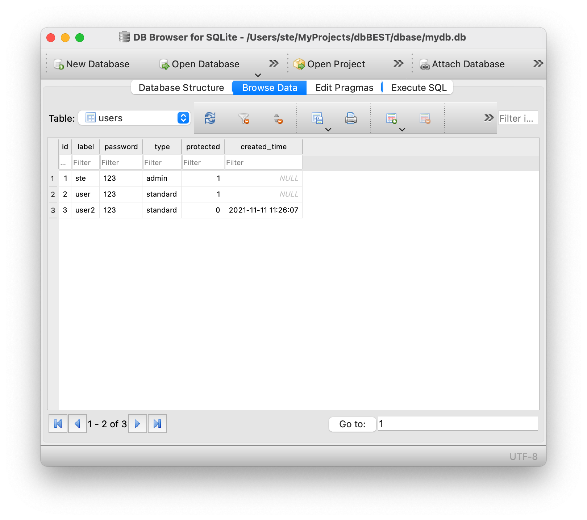
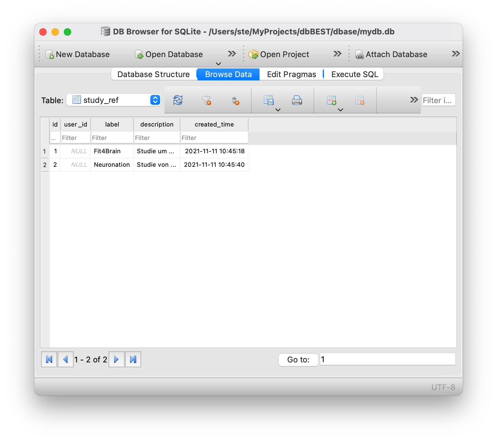
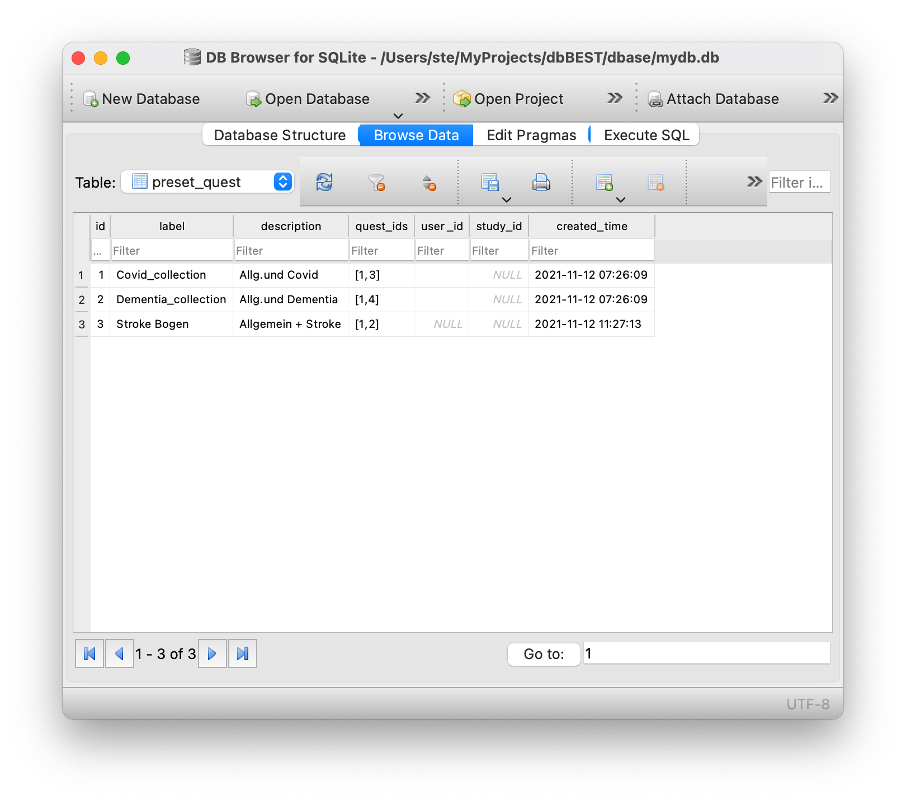

Struktur der DB und wichtige Tables
===================================

Die Daten selber werden in einer SQLITE DB gespeichert. Der prinzipielle Aufbau der SQL Tables ist in der folgenden Abbildung dargestellt.

   Übersicht der SQL Tables

Zum direkten Bearbeiten der DB kann jedes SQLITE kompatible Programm verwendet werden.

   Beispiel: DB Browser for SQLite (MacOS)

1. Table: *list_quests*
-----------------------

.. code-block::
   :caption: SQL code zum Erzeugen des Tables

   CREATE TABLE "list_quests" (
      "id"	INTEGER UNIQUE,
      "label"	TEXT,
      "description"	TEXT,
      "coding"	TEXT DEFAULT '[]',
      "creator"	TEXT DEFAULT 'sb',
      "created_time"	TEXT DEFAULT CURRENT_TIMESTAMP,
      "protected"	INTEGER DEFAULT 0 COLLATE BINARY,
      PRIMARY KEY("id" AUTOINCREMENT)
   );

Dieser Table enthält eine Liste aller verfügbaren Fragebögen mit

+ label: Name des Tables
+ description: Beschreibung
+ protected: wenn 1, dann kann der Eintrag nicht mehr in der APP bearbeitet werden

   Beispielinhalt des Tables *list_quests*

2. Table(s) *quest_*
--------------------

Alle Fragebögen sind mit dem Standardtemplate *quest_TEMPLATE* erstellt.

.. code-block::
   :caption: SQL code zum Erzeugen des Tables

   CREATE TABLE "quest_TEMPLATE" (
      "id"	INTEGER UNIQUE,
      "visit_id"	INTEGER,
      "some_content"	TEXT,
      "protected"	INTEGER DEFAULT 0 COLLATE BINARY,
      "created_time"	TEXT DEFAULT CURRENT_TIMESTAMP,
      PRIMARY KEY("id" AUTOINCREMENT)
   );

   Beispielinhalt eines quest Tables

3. Table *patients*
-------------------

.. code-block::
   :caption: SQL code zum Erzeugen des Tables

   CREATE TABLE "patients" (
      "id"	INTEGER UNIQUE,
      "name"	TEXT,
      "first_name"	TEXT,
      "birthdate"	TEXT,
      "gender"	TEXT,
      "protected"	INTEGER COLLATE BINARY,
      "created_time"	INTEGER DEFAULT CURRENT_TIMESTAMP,
      PRIMARY KEY("id" AUTOINCREMENT)
   );

   Beispielinhalt des Tables *patients*

4. Table *visits*
-------------------

.. code-block::
   :caption: SQL code zum Erzeugen des Tables

   CREATE TABLE "visits" (
      "id"	INTEGER,
      "label"	TEXT DEFAULT 'Neue Visite',
      "description"	TEXT,
      "patient_id"	INTEGER,
      "date_start"	TEXT DEFAULT CURRENT_TIMESTAMP,
      "date_end"	TEXT,
      "user_id"	INTEGER,
      "study_ref_id"	INTEGER,
      "protected"	INTEGER COLLATE BINARY,
      "created_time"	INTEGER DEFAULT CURRENT_TIMESTAMP,
      PRIMARY KEY("id" AUTOINCREMENT)
   );

   Beispielinhalt des Tables *visits*

5. Table *users*
-------------------

.. code-block::
   :caption: SQL code zum Erzeugen des Tables

   CREATE TABLE "users" (
      "id"	INTEGER,
      "label"	TEXT,
      "password"	TEXT,
      "type"	TEXT,
      "protected"	INTEGER DEFAULT 0 COLLATE BINARY,
      "created_time"	INTEGER DEFAULT CURRENT_TIMESTAMP,
      PRIMARY KEY("id" AUTOINCREMENT)
   );

   Beispielinhalt des Tables *users*

5. Table *study_ref*
--------------------

.. code-block::
   :caption: SQL code zum Erzeugen des Tables

   CREATE TABLE "study_ref" (
      "id"	INTEGER UNIQUE,
      "user_id"	INTEGER,
      "label"	TEXT,
      "description"	TEXT,
      "created_time"	INTEGER DEFAULT CURRENT_TIMESTAMP,
      PRIMARY KEY("id" AUTOINCREMENT)
   );

   Beispielinhalt des Tables *study_ref*

6. Table *preset_quest*
-----------------------

.. code-block::
   :caption: SQL code zum Erzeugen des Tables

   CREATE TABLE "preset_quest" (
      "id"	INTEGER UNIQUE,
      "label"	TEXT DEFAULT 'Name der Zusammenstellung',
      "description"	TEXT DEFAULT 'Zusammenstellung von Fragebögen',
      "quest_ids"	TEXT DEFAULT '[1]',
      "user_id"	INTEGER,
      "study_id"	INTEGER,
      "created_time"	TEXT DEFAULT CURRENT_TIMESTAMP,
      PRIMARY KEY("id" AUTOINCREMENT)
   );

   Beispielinhalt des Tables *preset_quest*

