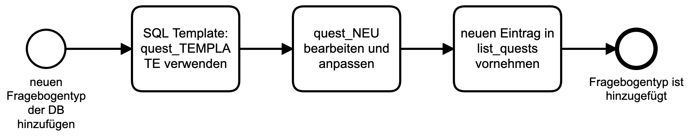
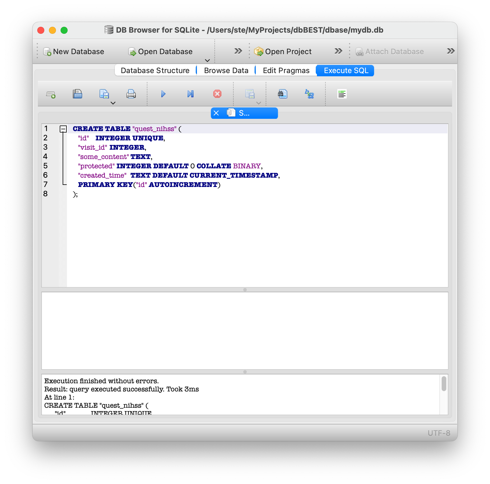
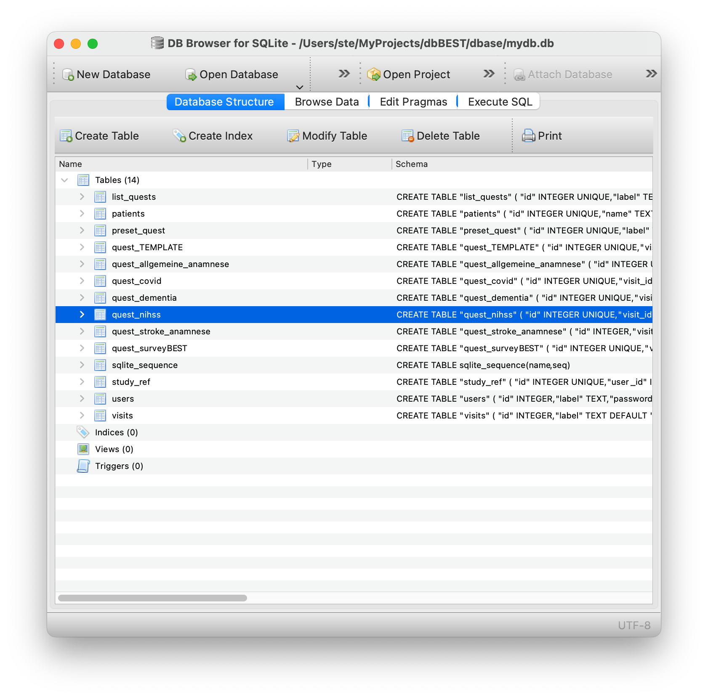
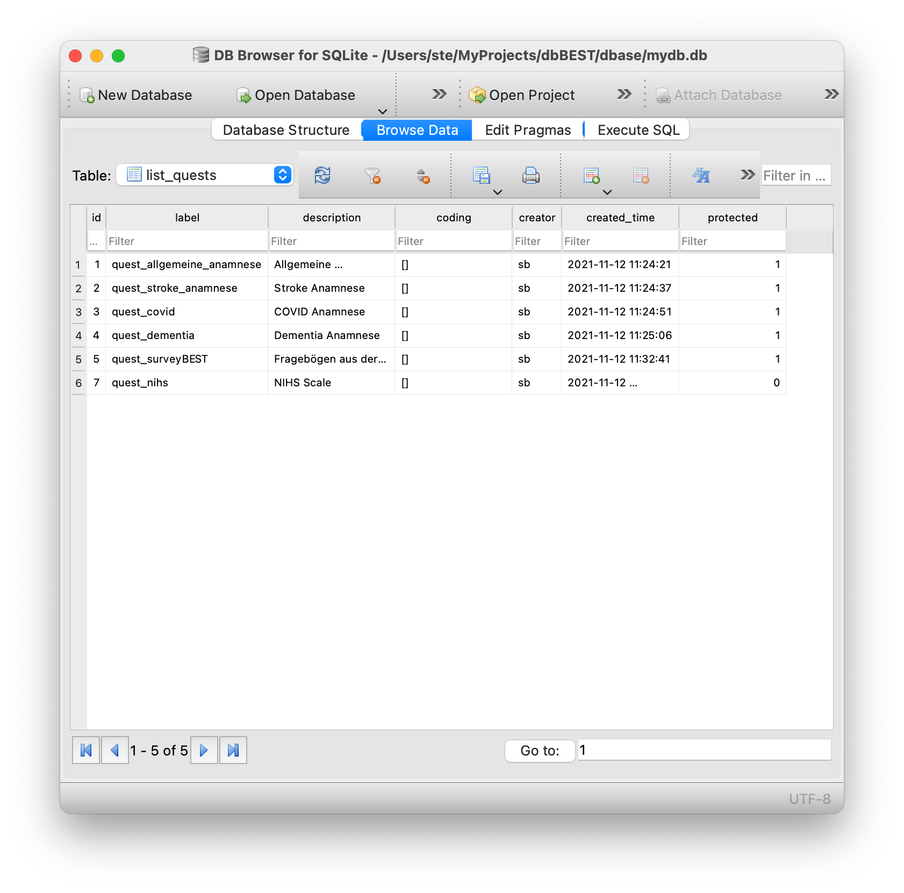
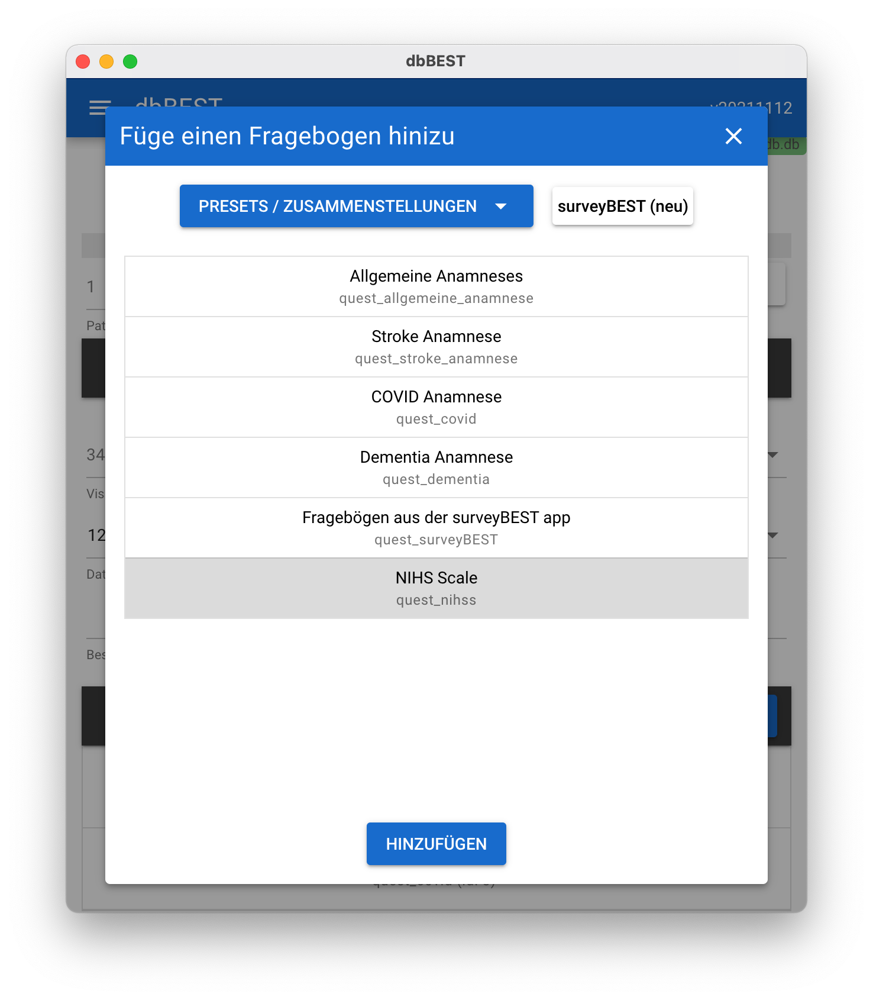

Neuen Fragebogen-Typ zur DB hinzufügen
======================================

Die folgende Abbildung zeigt die notwendigen Schritte,um eine neuen Fragebogen zu erzeugen:

   Schritte, um einen neuen Fragebogentyp der DB hinzuzufügen

1. Mit dem Code von quest_TEMPLATE einen neuen Fragebogen-Table erzeugen
------------------------------------------------------------------------

.. code-block::
   :caption: SQL Code von quest_TEMPLATE verwenden (Namen anpassen)

   CREATE TABLE "quest_nihss" (
      "id"	INTEGER UNIQUE,
      "visit_id"	INTEGER,
      "some_content"	TEXT,
      "protected"	INTEGER DEFAULT 0 COLLATE BINARY,
      "created_time"	TEXT DEFAULT CURRENT_TIMESTAMP,
      PRIMARY KEY("id" AUTOINCREMENT)
   );

Und mit diesem Code einen Table erzeugen.
   Z.B. mit DB Browser SQLite f. MacOS

   Erzeugen des Tables mit DB Brower for SQLite (MACOS)

Anschließend kann der Table bearbeitet werden.

   Neuer Table in der DB

2. Neuen Fragebogen anpassen / modifizieren
-------------------------------------------

Auch für diesen Schritt benötigt man aktuell einen DB Browser.
   Alternativ kann natürlich auch direkt er korrekte SQL Code verwendet werden :-)

   Anpassen des Fragebogens

3. Zum Schluss muss noch der Table *list_quests* angepasst werden
-----------------------------------------------------------------

   Neuen Eintrag zum Table *list_quests* hinzufügen. **Wichtig**: *label* entspricht dem Namen des neuen Tables.

Fertig
------

Jetzt kann der neue Fragebogen einer Visite hinzugefügt werden.
**Anmerkung**: Dafür muss die App aber neu gestartet werden.

   Neuer Fragebogen erscheint in der Auswahl und kann einer Visite hinzugefügt werden
