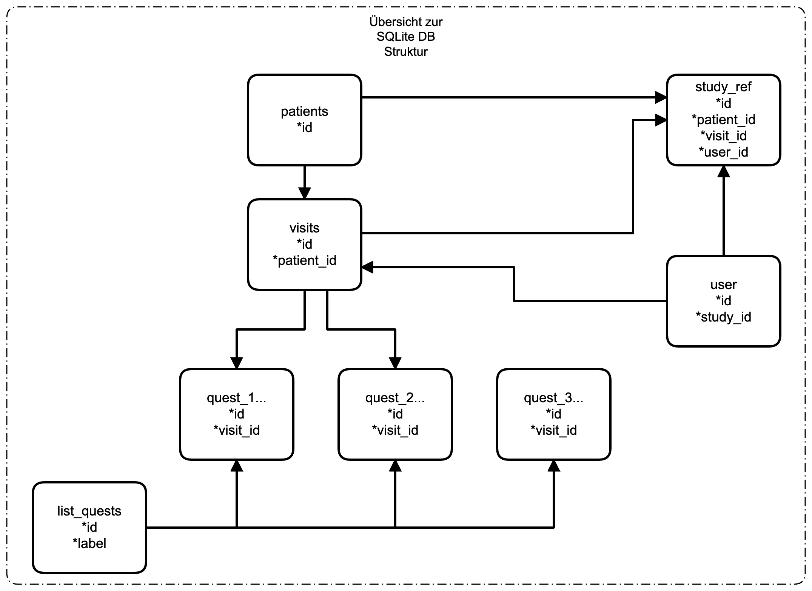

dbBEST Nutzeranleitung
=======================

Anleitung für Anwender

   Übersicht der SQL Tables

.. toctree::
   :maxdepth: 1
   :caption: Contents:

   X01_einleitung
   XX_about

Index und Suche
===============

* :ref:`genindex`
* :ref:`search`
